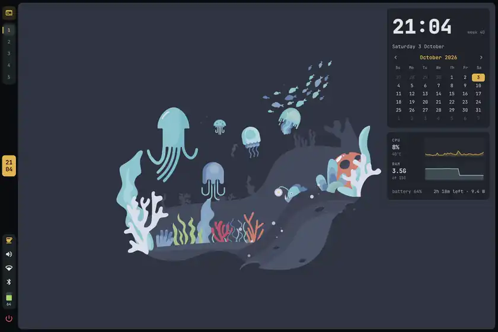

<div align="center">

# bezel

**A Hyprland + Quickshell desktop for Arch Linux.**

[](https://github.com/vmaltarello/bezel-hyprland/releases)
[](LICENSE)
[](https://hyprland.org)
[](https://quickshell.org)
[](https://archlinux.org)
[](https://github.com/vmaltarello/bezel-hyprland/stargazers)

A night-blue frame wraps the screen like a monitor bezel, a vertical bar holds everything you need,
and one lavender accent marks what matters; every element carries the same 45° cut on its top-left corner. Every dependency comes from the official Arch repositories.



[▶ Full demo video (84 s, 1440p 60 fps)](docs/demo.mp4)

</div>

## Screenshots

| | | |
|---|---|---|
|  |  |  |
| Desktop widgets | Launcher (`SUPER+Space`) | Overview (`SUPER+Tab`) |

**[→ All screenshots](docs/SCREENSHOTS.md)** — menus, OSD, lock and login screens, screenshot tool and more.

<sub>Wallpapers: "underwater" and "minimal landscape" from [D3Ext/aesthetic-wallpapers](https://github.com/D3Ext/aesthetic-wallpapers) — not included in bezel.</sub>

## Features

- **Screen frame** — a thin dark frame around the screen; only the window corners that touch the screen corners are rounded.
- **Vertical bar** — workspaces with the icons of their apps, clock, tray, Wi-Fi, Bluetooth, audio, battery and session menus that grow out of the bar.
- **Launcher** (`SUPER+Space`) — comes down from the top edge of the frame: apps, shell commands (`>`), files and folders (`/`), web search (`?`), clipboard history, wallpapers and a searchable list of every shortcut.
- **Overview** (`SUPER+Tab` or three fingers up) — all windows of the workspace, drag them to another workspace.
- **Desktop widgets** (on empty workspaces) — calendar, CPU/RAM graphs, battery, now playing, available updates.
- **Screenshots** (`Print`) — freeze the screen, then pick an area, a window or the whole screen; optional annotation with satty.
- **Lock and login screens** — the same design for both (the login screen is optional).
- **Notifications, OSD, do not disturb, caffeine** — built into the shell, no extra daemons.
- **One palette everywhere** — kitty, GTK and Qt apps, yazi, btop, lazygit, starship, zathura, imv, Zed and neovim.
- **Light on resources** — the shell renders in software and stops refreshing what you can't see.

## Requirements

- Arch Linux (or an Arch-based distribution)
- Hyprland **0.56 or newer** (bezel uses the Lua configuration)
- A Wayland-capable GPU and about 1 GB of free disk space for the packages

## Install

Pick one of the two channels:

### Stable release (recommended)

A tagged version, tested before release. The newest one is on the [Releases](https://github.com/vmaltarello/bezel-hyprland/releases) page.

```sh
git clone --branch v0.2.0 https://github.com/vmaltarello/bezel-hyprland.git bezel
cd bezel
./install.sh
```

### Latest from `main`

The newest changes as soon as they are pushed — may be less polished.

```sh
git clone https://github.com/vmaltarello/bezel-hyprland.git bezel
cd bezel
./install.sh
```

### What the installer does

The installer asks a few questions, then:

1. installs the missing packages with `pacman` (it lists them first),
2. **saves** every config file it is about to replace into `~/.local/state/bezel/backup/`,
3. copies the theme into `~/.config`, fills in your keyboard layout and sets the GTK theme,

Then log in to a Hyprland session. Press `SUPER+H` to see every shortcut.

> [!IMPORTANT]
> **Already using Hyprland?** bezel **replaces** your configuration: your `hyprland.conf`/`hyprland.lua`,
> Quickshell config, kitty, GTK/Qt theme and the other files of the components you choose are moved to
> `~/.local/state/bezel/backup/` (nothing is deleted). Your monitors, keybindings and autostart apps are
> **not** carried over: copy what you need from the backup into the new `~/.config/hypr/hyprland.lua`.
> `./uninstall.sh` puts all of it back exactly as it was. Packages you already had are never removed.

| Option | |
|---|---|
| `--yes` | take the default answer everywhere |
| `--all` | install every optional component |
| `--only yazi,btop` | choose optional components (core is always installed) |
| `--greeter` | also replace your display manager with the bezel login screen (greetd) |
| `--no-packages` | only install the config files |
| `--link` | symlink the files to the repo instead of copying them (for development) |

**Components:** `core` (Hyprland, the shell, kitty, GTK/Qt theme) is always installed.
Optional: `yazi`, `btop`, `lazygit`, `starship`, `zathura`, `imv`, `zed`, `nvim` (off by default: it replaces your neovim config).

## Update

Run the command for the channel you installed from, inside the `bezel` folder:

| Channel | Command |
|---|---|
| Stable release | `git fetch --tags && git checkout <new-tag> && ./install.sh` (e.g. `v0.2.0`) |
| `main` | `git pull && ./install.sh` |

To switch channel: `git checkout main` moves a release install to `main`, `git checkout <tag>` does the opposite.

Theme files are replaced; `~/.config/hypr/hyprland.lua` is yours and is never overwritten.

kitty doesn't reload its config by itself (that would keep an extra ~20 MB watcher process running): after an update, or after editing `kitty.conf`, press `Ctrl+Shift+F5` in kitty (or close every kitty window and start it again).

## Uninstall

```sh
./uninstall.sh
```

Every file bezel installed is removed and your previous configuration is put back exactly as it was,
including GTK settings and the previous display manager. Packages are kept unless you ask
(`./uninstall.sh --packages`); packages other programs need are never removed.

## Customize

- **Your settings** — `~/.config/hypr/hyprland.lua`: monitors, keyboard, default apps (`terminal`, `browser`, …) and anything else you want to add or override.
- **Colors, fonts, sizes** — `~/.config/quickshell/config/Theme.qml`.
- **Shell behaviour** — `~/.config/quickshell/config/Config.qml`: clock format, warning thresholds, commands opened from the bar.
- **Wallpapers** — put your images in `~/Pictures/Wallpapers`, then pick one with `SUPER+W` (thumbnails) or `SUPER+Shift+W` (next).

## Shortcuts

| Keys | Action |
|---|---|
| `SUPER+Space` | Launcher |
| `SUPER+Tab` | Overview |
| `SUPER+H` | List of all shortcuts |
| `SUPER+T` / `SUPER+E` / `SUPER+B` | Terminal / file manager / browser |
| `SUPER+V` | Clipboard history |
| `SUPER+W` / `SUPER+Shift+W` | Choose / next wallpaper |
| `Print` | Screenshot |
| `SUPER+Q` | Close window |
| `SUPER+Z` | Focus mode (large centered window, rest dimmed) |
| `SUPER+F` / `SUPER+Shift+F` | Maximize / fullscreen |
| `SUPER+R` | Cycle window size: 1/2, 2/3, 1/3 |
| `SUPER+Enter` | Swap window with the largest one |
| `SUPER+1…5` / `SUPER+Shift+1…5` | Go to / move window to workspace |
| `SUPER+N` | Do not disturb |
| `SUPER+L` | Lock |
| `SUPER+Escape` | Log out |

Touchpad: three fingers left/right switch workspace, up/down open and close the overview.

## Contributing

Bug reports, ideas and pull requests are welcome — please read [CONTRIBUTING.md](CONTRIBUTING.md) first.

## Credits

Built with [Hyprland](https://hypr.land) and [Quickshell](https://quickshell.org).

## License

[GPL-3.0-or-later](LICENSE). Copyright (C) 2026 Vladimir Alberto Maltarello.
